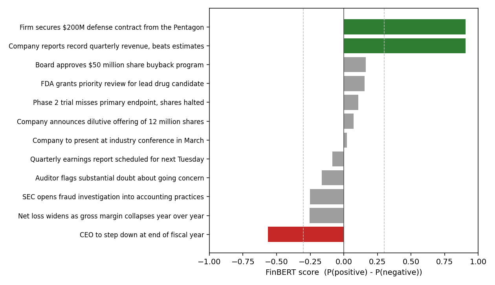
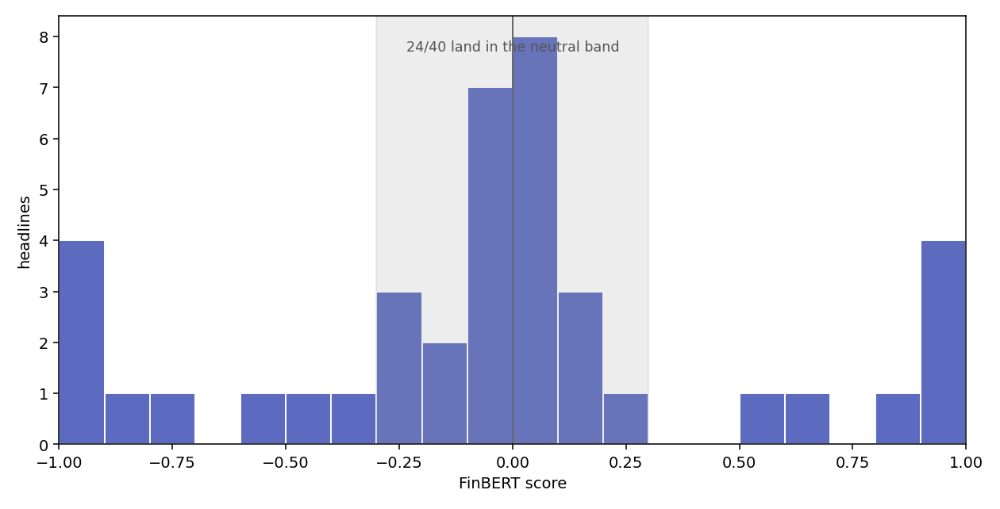

# news-scraper

scrapes micro-cap news and scores how much each headline should move the stock.

started from one question: is a pre-trained sentiment model enough on its own? used FinBERT ([Araci, 2019](https://arxiv.org/abs/1908.10063)). it isn't.

score = P(positive) - P(negative), range -1 to +1.



- middle is the problem: "Phase 2 trial misses primary endpoint, shares halted" reads slightly positive, so does a dilutive offering
- it scores word tone, not stock impact



- 24 of 40 headlines land flat in [-0.3, 0.3]
- wire copy is terse and hedged, where FinBERT has least to grab

so sentiment is one input. alpha score = weighted sum:

- event type (offering, SEC filing, going concern) 0.35
- FinBERT sentiment 0.25
- source reliability 0.15
- recency 0.15
- float / liquidity 0.10

a dilutive offering reads bearish at -0.4 regardless of wording; sentiment only nudges ties.

stack: FastAPI backend, ingestion workers, ticker linking, Next.js dashboard.

figures:

```
pip install torch transformers matplotlib
python scripts/make_readme_figures.py
```
