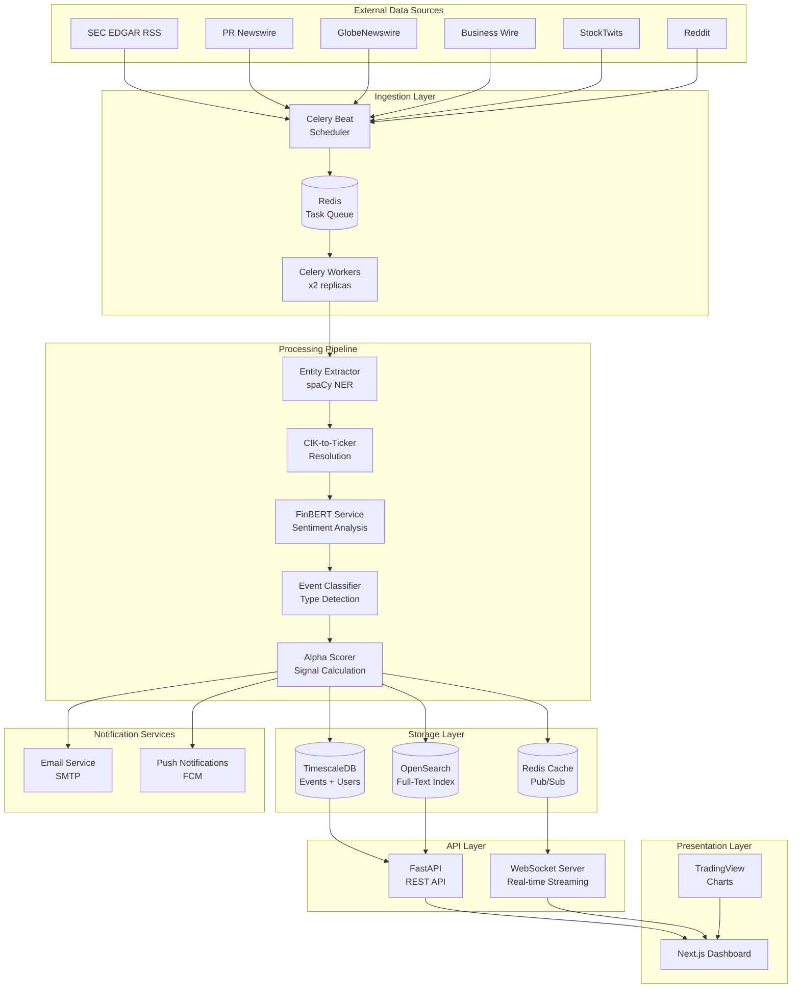
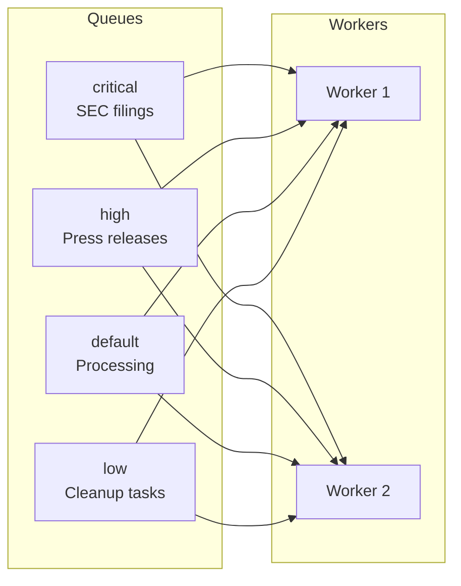
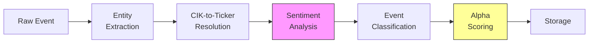
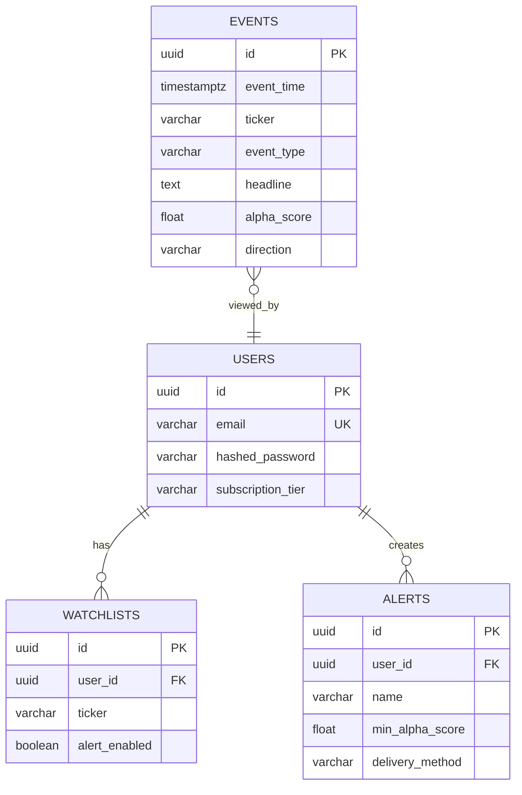
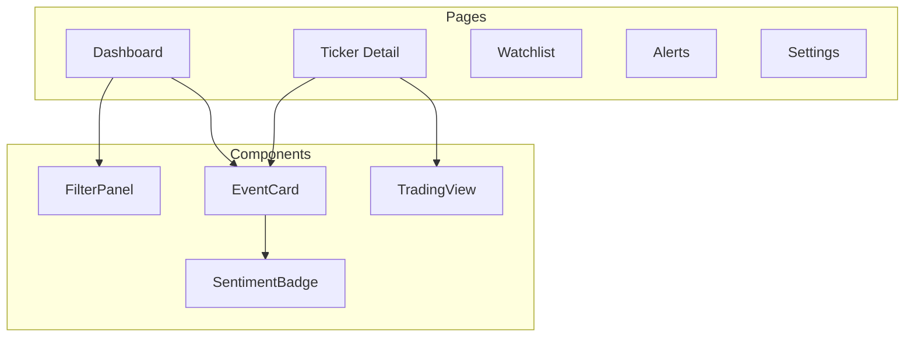
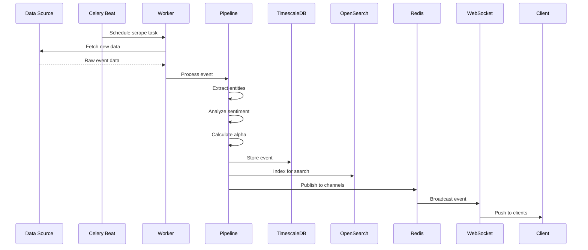
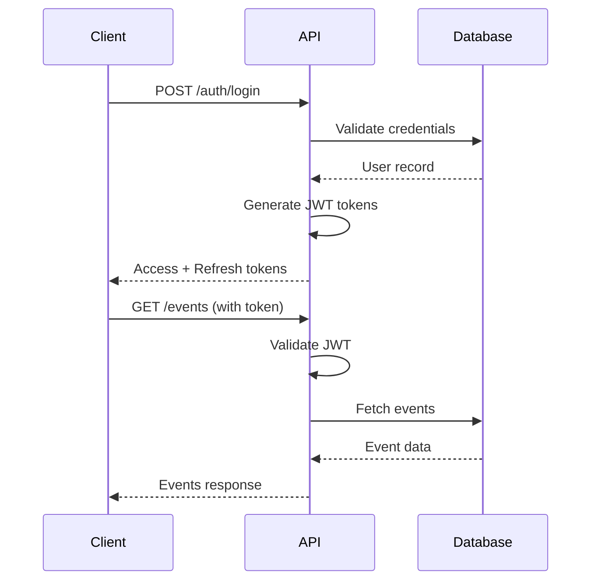
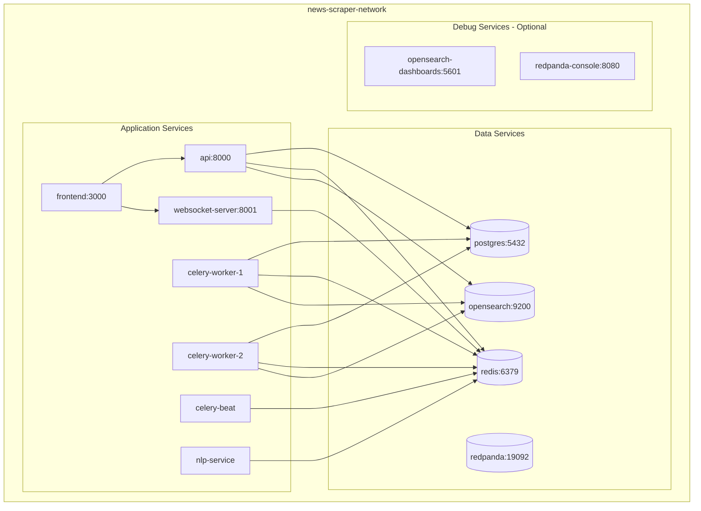
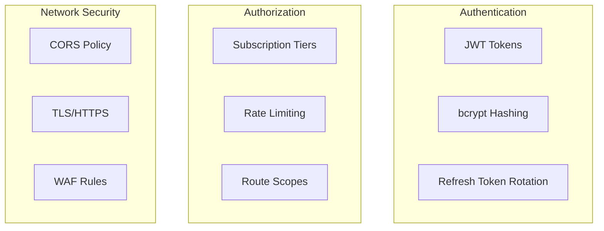
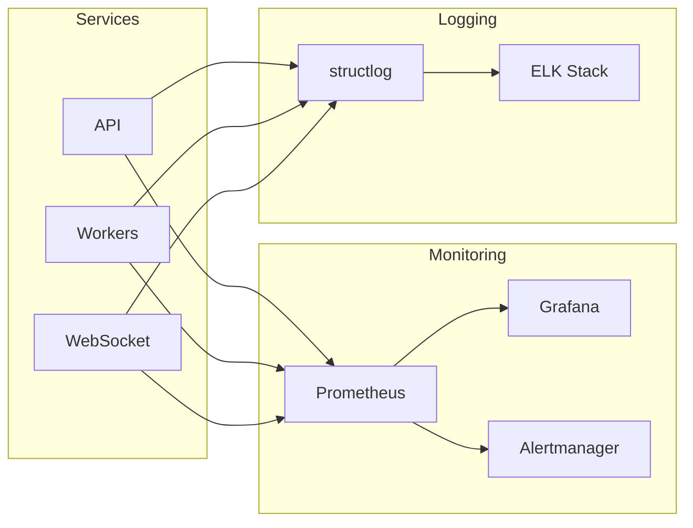

# Micro-Alpha News Scraper - System Architecture

This document describes the system architecture of the Micro-Alpha News Scraper platform, including component relationships, data flows, and deployment topology.

## Overview

Micro-Alpha is a real-time financial news aggregation and sentiment analysis platform. The system ingests data from multiple sources, processes it through an NLP pipeline, calculates trading signals, and delivers results via REST API and WebSocket streaming.

## High-Level Architecture



## Component Details

### 1. Data Sources

| Source | Polling Interval | Data Type | Priority |
|--------|------------------|-----------|----------|
| SEC EDGAR | 10 seconds | Form 4, 8-K, 13D/G | Critical |
| PR Newswire | 60 seconds | Press releases | High |
| GlobeNewswire | 60 seconds | Press releases | High |
| Business Wire | 60 seconds | Press releases | High |
| StockTwits | 120 seconds | Social sentiment | Medium |
| Reddit | 120 seconds | Social mentions | Medium |

### 2. Ingestion Layer

#### Celery Beat (Scheduler)
- **Purpose**: Orchestrates periodic scraping tasks
- **Configuration**: Redis as broker (DB 1)
- **Tasks**: Defined in `backend/workers/tasks/`

#### Celery Workers
- **Replicas**: 2 workers for horizontal scaling
- **Queues**: `critical`, `high`, `default`, `low`
- **Concurrency**: 4 processes per worker



### 3. Processing Pipeline

The NLP pipeline processes each event through multiple stages:



#### Entity Extraction
- **Technology**: spaCy + regex patterns
- **Extracts**: Tickers, company names, people, dollar amounts
- **Validation**: Against SEC ticker knowledge base

#### Sentiment Analysis
- **Primary**: FinBERT (HuggingFace Transformers)
- **Fallback**: Keyword-based sentiment (SimpleSentimentService)
- **Output**: Score (-1 to +1), Label, Confidence

#### Alpha Scoring
Multi-factor signal calculation:

| Factor | Weight | Description |
|--------|--------|-------------|
| Event Type | 35% | Insider buy = 0.9, FDA approval = 0.95 |
| Sentiment | 25% | FinBERT score |
| Source | 15% | SEC = 1.0, PR Newswire = 0.8, Social = 0.5 |
| Recency | 15% | Exponential decay from event_time |
| Liquidity | 10% | Inverse market cap weighting |

### 4. Storage Layer

#### TimescaleDB (PostgreSQL)
- **Purpose**: Primary event storage with time-series optimization
- **Features**: Hypertable partitioning, continuous aggregates
- **Tables**: `events`, `users`, `watchlists`, `alerts`



#### OpenSearch
- **Purpose**: Full-text search and aggregations
- **Index**: `events` with custom analyzers
- **Features**: Fuzzy matching, highlighting, autocomplete

#### Redis
- **DB 0**: Application cache
- **DB 1**: Celery broker
- **DB 2**: Celery result backend
- **Pub/Sub Channels**:
  - `events:all` - All events
  - `events:high_alpha` - High alpha events
  - `events:ticker:{SYMBOL}` - Per-ticker channels

### 5. API Layer

#### FastAPI REST API
- **Port**: 8000
- **Authentication**: JWT Bearer tokens
- **Rate Limiting**: Tier-based (30-3000 req/min)
- **Documentation**: OpenAPI/Swagger at `/docs`

```mermaid
flowchart TB
    subgraph Endpoints
        AUTH[/api/v1/auth]
        EVENTS[/api/v1/events]
        SEARCH[/api/v1/search]
        TICKERS[/api/v1/tickers]
        WATCHLIST[/api/v1/watchlist]
        ALERTS[/api/v1/alerts]
        BILLING[/api/v1/billing]
        STATS[/api/v1/stats]
    end

    subgraph Middleware
        CORS[CORS]
        RATE[Rate Limiter]
        JWT[JWT Auth]
    end

    CLIENT[Client] --> CORS
    CORS --> RATE
    RATE --> JWT
    JWT --> Endpoints
```

#### WebSocket Server
- **Port**: 8001
- **Endpoints**:
  - `/ws/events` - All events stream
  - `/ws/events/watchlist` - User watchlist events
  - `/ws/events/ticker/{ticker}` - Single ticker stream
  - `/ws/events/high-alpha` - High alpha events only

### 6. Frontend

#### Next.js Dashboard
- **Framework**: Next.js 14 with App Router
- **Styling**: TailwindCSS
- **State**: React Query for server state
- **Charts**: TradingView widget integration



## Data Flow

### Event Ingestion Flow



### User Authentication Flow



## Deployment Topology

### Docker Compose Services



### Resource Requirements

| Service | CPU | Memory | Storage |
|---------|-----|--------|---------|
| API | 0.5 | 512MB | - |
| WebSocket | 0.25 | 256MB | - |
| Frontend | 0.25 | 256MB | - |
| Celery Worker (x2) | 1.0 | 1GB | - |
| Celery Beat | 0.1 | 128MB | - |
| NLP Service | 1.0 | 2GB | 2GB (model cache) |
| PostgreSQL | 1.0 | 1GB | 20GB+ |
| Redis | 0.25 | 512MB | 1GB |
| OpenSearch | 1.0 | 1GB | 10GB+ |
| Redpanda | 0.5 | 1GB | 5GB+ |

## Security Architecture

### Authentication & Authorization



### Subscription Tiers

| Tier | Rate Limit | WebSocket | API History | Alerts |
|------|------------|-----------|-------------|--------|
| Starter | 60/min | Yes | 7 days | 5 |
| Professional | 300/min | Yes | 30 days | 25 |
| Team | 600/min | Yes | 90 days | 100 |
| Enterprise | 3000/min | Yes | Unlimited | Unlimited |

## Scalability Considerations

### Horizontal Scaling Points

1. **Celery Workers**: Add more replicas for increased processing throughput
2. **API Servers**: Load balance across multiple FastAPI instances
3. **WebSocket Servers**: Shard by user/ticker with sticky sessions
4. **Read Replicas**: Add PostgreSQL read replicas for query scaling

### Vertical Scaling Points

1. **NLP Service**: GPU acceleration for FinBERT inference
2. **OpenSearch**: Increase memory for larger indices
3. **Redis**: Cluster mode for high availability

## Monitoring & Observability

### Metrics Collection



### Key Metrics

- **Latency**: Event ingestion time, API response time
- **Throughput**: Events/second, requests/second
- **Error Rates**: 4xx/5xx responses, task failures
- **Queue Depth**: Celery queue sizes
- **Resource Usage**: CPU, memory, disk I/O

## Future Architecture Considerations

1. **Kubernetes Migration**: Move from Docker Compose to K8s for production
2. **Event Sourcing**: Implement CQRS pattern with Redpanda
3. **Multi-Region**: Geographic distribution for lower latency
4. **ML Pipeline**: MLflow for model versioning and A/B testing
5. **GraphQL**: Alternative API for flexible queries

---

*Last Updated: January 23, 2026*
